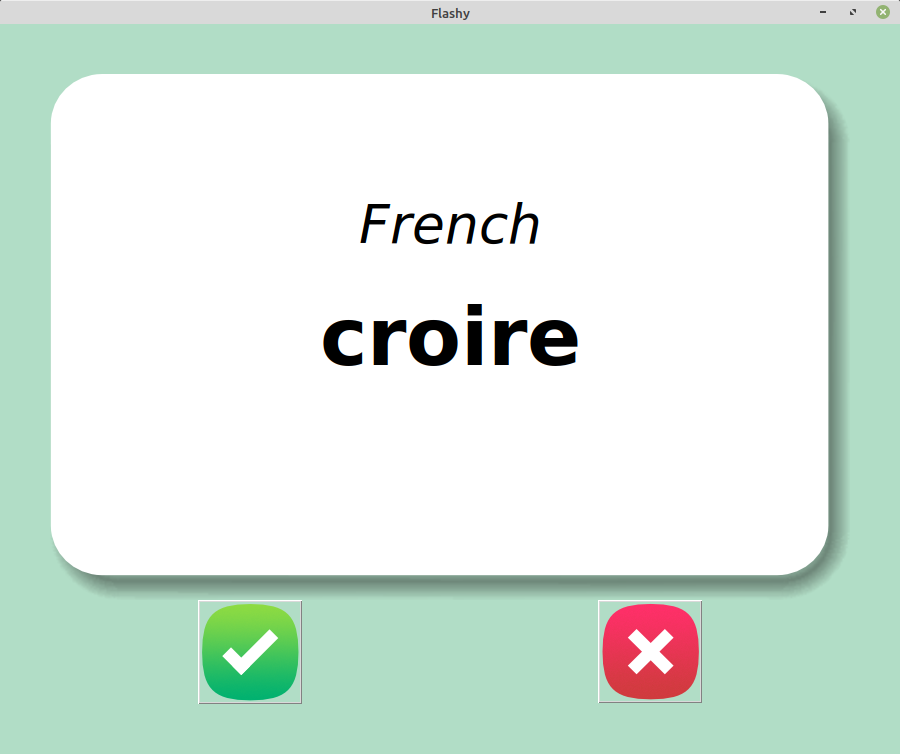

# Day31

## Capstone
### Language_flashcard

> Built using tkinter this program helps you learn some of the top 100 French words
### Preview:



## How to run this on your device

- Clone this repository
```
git clone https://github.com/kingdreamerr/Day31_Language_flashcard.git
```
- cd into the repo
```
cd Day31_Language_flashcard
```

- Paste the following in the terminal 
```
python3 main.py
```